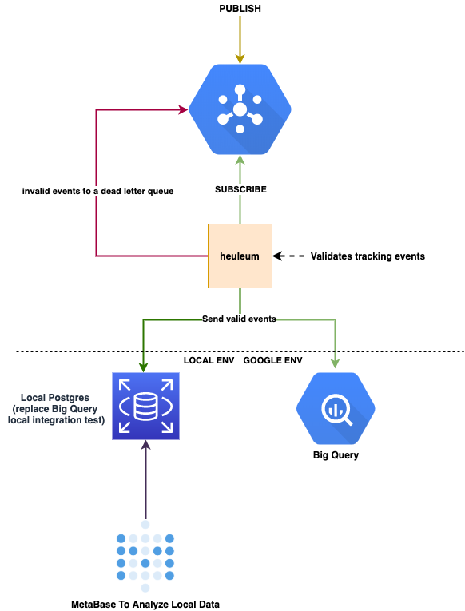

# heuleum

TODO: Under progress!

heuleum is an application that handles subscribes data from a google pub-sub service. The meaning
of heuleum is stream in korean.



# Setup

## Requirements

* Python3.7 (if running locally)
* Docker & docker-compose
* pipenv

# Pub-Sub

Pub/Sub is an asynchronous messaging service that decouples services that produce events from services that process events.

You can use Pub/Sub as messaging-oriented middleware or event ingestion and delivery for streaming analytics pipelines.

## GCP

### Dead letter queue

As of beginning 2020, Google Pub/Sub now supports configuring dead letter topic when creating a
subscription (just like other major queueing systems):

```bash
gcloud pubsub subscriptions create SUBSCRIPTION \
  --topic=TOPIC \
  --topic_project=TOPIC_PROJECT \
  --max-delivery-attempts=NUMBER_OF_RETRIES \
  --dead-letter-topic=DEAD_LETTER_TOPIC \
  --dead-letter-topic-project=DEAD_LETTER_TOPIC_PROJECT
```

Make sure that this is enabled, either as infrastructure as code or that command above has been run:

```bash
gcloud pubsub subscriptions create SUBSCRIPTION \
  --topic=events \
  --topic_project=event-tracker \
  --max-delivery-attempts=5 \
  --dead-letter-topic=events_deadletter \
  --dead-letter-topic-project=event-tracker-deadletter
```

## Local

When we run this code locally we utilise `bigtruedata/gcloud-pubsub-emulator:latest`. This means
that after the dead letter queue can't be created with statement above, reading the docs
https://cloud.google.com/pubsub/docs/emulator#using_the_emulator. Which states:

```json
To use the emulator, you must have an application built using the Google Cloud Client Libraries. The emulator does not support Cloud Console or gcloud pubsub commands.
```

Which means the following steps needs to have been done:

```bash
make create_topics
```

Which will create the main topic `events` and the dead-letter topic `deadletter_events`. This is
mainly a workaround we do to test this in integration test mode locally via the docker image which
emulates `pub-sub`.